# Polynomial Regression Network for Variable-Number Lane Detection
Şerit tespiti güvenli bir otonom sürüş için temel ama zorlu görevlerden biridir. Ortam koşullarının değişmesi(güneş ışığı, gölge, yağmur,ışık yansıması), araçlar, yayalar gibi şeritlerin bazı kısımlarını kapatan etkenlerden dolayı şerit çizgileri her zaman doğru bir şekilde tespit edilemeyebilmektedir.

Önceki şerit tespit yöntemlerinin çoğunda anlamsal bölütleme kullanılır. Daha sonra herhangi bir sebeple görünmeyen şeritleri yeniden çizebilmek için bazı eğri uydurma yöntemlerine başvurulur. Fakat bu yöntemlerin karmaşık trafik koşullarında şerit çizgilerini tespit etmekte çok başarılı olmadığı görülmüştür.
Bu çalışma diğer yöntemlerin aksine anlamsal bölütleme kullanılmadan ve görüntü üzerinde son işleme gerek kalmadan yeni bir polinom regresyon ağı PRNet kullanılarak şeritleri tespit etmeyi öneriyor. 
PRNet temelde bir ana ve iki yardımcı daldan oluşur: 
* Şeritlerin polinom katsayılarını tahmin etmek için polinom regresyon 
* Her şeridin başlangıç noktasını belirlemek için başlangıç sınıflandırması 
* Her şeridin bitiş noktasını belirlemek için yükseklik regresyonu 
Bu üç yöntemin işbirliğiyle PRNet değişken sayıda şeritleri algılayabilir. 

## İlgili Çalışmalar
### Geleneksel Yöntemler
Geleneksel yöntemler genellikle şerit çizgilerini temsil etmek için manuel değiştirilmesi gereken özellikleri kullanır. Örneğin Gauss filtresi, Gabor filtresi şerit tespitinde kenar özelliklerini çıkarmayı benimsemiştir. Daha iyi sonuçlar elde etmek için histogram tabanlı ve renk özelliklerini kullanan yöntemlere de başvurulur. Hough transform son işleme olarak şerit yerleştirmeyi kullanır. Fakat gerçek zamanlı uygulamada ve karmaşık trafik koşullarında geleneksel yöntemler ciddi performans kaybı yaşarlar.

### CNN  Tabanlı Yöntemler

Özellikle son yıllarda görüntü üzerindeki işlemlerde güçlü performans gösterdiğinden bir çok CNN tabanlı şerit algılama yöntemi önerilmiştir.

#### 1-Segmentasyon Tabanlı Yöntemler
**VPGNet** Ufuk noktalarından (üç boyutlu uzayda paralel şerit çizgilerinin birleştiği varsayılan nokta) yararlanarak şerit ve yol tespit işlemlerini birlikte yürüten çok görevli bir birleşik ağ önerir. 
**SPATİAL CNN (SCNN)** Özellik haritaları içinde bir katmandaki satırlar ve sütunlar boyunca  pikseller arasındaki mesaj geçişlerini sağlayan ilişkileri yakalar.
CNN ile karşılaştırıldığında şerit çizgilerini daha sürekli algılayabildiği görülmüştür. 
**LaneNet** Şerit algılamayı “instance segmentation” gibi formülize etmeyi önerir.
Şeritleri daha iyi tespit etmek  için perspektif dönüşüm matrisini tahmin eder. 
**GAN(EL-GAN)** Hem etiketlere hem de tahmine dayalı olarak ayrım yapar. EL-GAN  aynı anda hem 'sahte' hem de 'gerçek' tahminleri görmekten faydalanır. Bu ayırt edici bilgiye sahip olunması nedeniyle model daha istikrarlı bir eğitim ile sonuçlanır.
EL-GAN framework anlamsal segmentasyon ağ çıktısının daha gerçekçi olmasını sağlamak için kullanılır ve karmaşık son işlemeye olan bağımlılığı azaltır. 
**SAD**  Herhangi bir denetim veya ek denetim olmadan bir modelin öğrenmesini sağlar. Bu yöntemde yeni bir bilgi aktarım yaklaşımı vardır, modelin kendisinden öğrenmesine izin verir. SAD, herhangi bir  ileri beslemeli evrişimli sinir ağlarına (CNN) kolayca dahil edilebilir ve çıkarım süresini arttırmaz. 

#### 2-SEGMENTASYON TABANLI OLMAYAN YÖNTEMLER
**Line-CNN**  Doğru trafik eğrilerini bulabilmek için referans olarak yine şeritleri kullanır. İyi bir performans için çok sayıda şerit önerisi gerekir.
Şerit özelliklerini çıkartmak için LPU olarak adlandırılan bir şerit öneri birimi kullanılır. LPU  görüntü üzerinde oluşturduğu çizgilerin konumuna göre şerit özelliklerini çıkarır.
Line-CNN'nin yanlış şerit önerilerini ortadan kaldırmak için “NMS” kullanması gerekir. 
Non-max Suppression(NMS): Görüntü üzerinde tespit edilen şeritlerden güven değeri en yüksek olanı belirler. 
**FASTDRAW** Aynı şeride ait komşu piksellerin ortak olasılık dağılımını (joint distribution) tahmin etmeyi önerir ve bir ikili segmentasyon haritasını referans alarak şeritleri yinelemeli olarak çizer. 
**3D LANENNET** Tek bir görüntüden bir yol üzerindeki şeritlerin üç boyutlu düzenini doğrudan tahmin eden bir uçtan uca ağ sunar. Ağırlıklı en küçük kareler problemini çözerek şerit eğrilik parametrelerini tahmin etmeyi önerir. Ancak her şerit için ayrı ayrı ağırlık haritası oluşturulması gereklidir, bu nedenle yalnızca sabit sayıda şerit algılayabilir. Ek olarak ağırlıklı en küçük kareler problemini çözmek için gerekli olan büyük matris işlemi zaman alıcıdır. 
Küçük Kareler Problemi(weighted least-squares problem): Asıl amaç model yardımıyla elde edilen tahmin değerlerinin gözlenen değerlerden sapmasını minimize etmektir. 

Eski yöntemlerin çoğunun, bazı son işleme yöntemlerini gerçekleştirmesi gerekir.
Segmentasyona dayalı yöntemlerde genellikle kümeleme veya şerit uydurma yöntemi kullanılması gereklidir. Açıkça görülüyor ki, bu çalışmalarda yapılan  son işlemler ekstra hesaplama maliyeti içerecektir. Önerilen ağ(PRNet) trafik şeritlerinin polinom gösterimi sayesinde karşılaşılabilecek gürültü problemlerinden büyük ölçüde etkilenmez. Ayrıca bir görüntüdeki şerit sayısının sabitlenmesi gerekmemektedir.

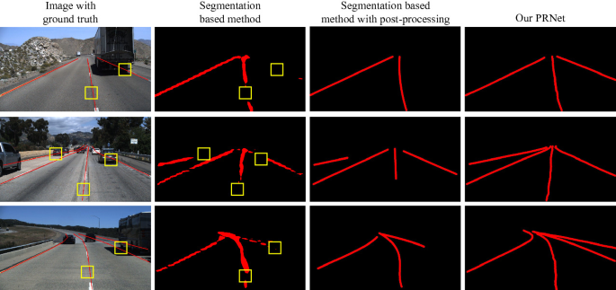 

# PRNet
PRNet’in ana fikri şeritleri temsil etmek için bir dizi görüntü pikseli yerine parçalı eğrileri  kullanmaktır. Bu amaçla şerit algılamayı bir ana  ve iki yardımcı göreve ayırır. Polinom regresyon, şerit parçalarının polinom katsayılarını tahmin etmek için; başlangıç sınıflandırması, her bir şeritte ilk polinom katsayısı alınacak noktayı belirlemek için; yükseklik regresyonu, tahmin edilen polinom eğrisi ile birlikte şeridin bitiş noktasını ve  bitiş noktasının görüntünün sınırına göre yüksekliğini belirlemek için kullanılır. PRNet, farklı şeritlerin piksellerine farklı anlamsal etiketler atayan segmentasyon tabanlı yöntemlerden farklı olarak, bir şeridi ilk erisim noktasindan(şerit parçasının başlangıç noktası) yararlanarak tanımlar. Şeritleri "object detecion" gibi tespit edebilir.

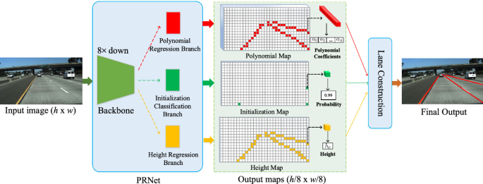 

PRNet özel ağı tarafından  giriş görüntüsü düşük çözünürlüklü özellik haritalarına dönüştürülür. Sonrasında üç aşama; polinom regresyon,başlangıç sınıflandırması ve yükseklik regresyonu özellik haritalarını  input  olarak alır ve çıktı olarak polinom eğrilerini tahmin eder. Sonunda şeritler bu üç yöntemden elde edilen bilgilerinin birleştirilmesiyle yeniden çizilir.

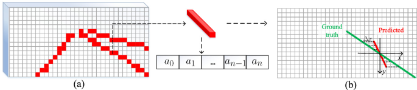 

(a)polinom haritası,kırmızı noktalar eğitim sırasında kullanılan polinom noktalarını temsil eder.
(b)kırmızı çizgi, bir polinom noktasından tahmin edilen bir polinom parçasını gösterir.Yeşil çizgi ground truth temsil eder. İki çizgideki örnek noktalar arasındaki fark eğitim sırasındaki kayıp (loss) değerini hesaplamak için kullanılır.

**Polinom Regresyon** 
Polinom regresyon bir görüntüdeki  şerit segmentlerinin polinom katsayılarını tahmin etmek için kullanılır. Bu amaçla çıktı, polinom haritası olarak adlandırılan girdi özellikleriyle aynı boyutta (n+1) kanallı bir harita olacak şekilde tasarlanır. Polinom haritasında bir nokta n dereceli bir polinomu gösterir. Görüntülerde şeritler  dikey olarak bölümlere ayrılır.
Her polinom parçası görüntüde örnek noktalara dönüştürülür.Sabit y koordinatına karşılık gelen yatay noktalar (x koordinatları) hesaplanır. Eğitim sırasındaki kayıp değerini bulmak için x koordinatındaki noktaların farkından yararlanılır.

**Başlangıç Sınıflandırması** 
Başlangıç sınıflandırması her şerit parçasının başlangıç noktasını elde etmek için kullanılır. Bu aşamada başlangıç haritası olarak adlandırılan, giriş özellikleriyle aynı boyutta bir olasılık haritası üretilir.  Bu haritayı tarayarak ilk erişim noktalarını elde edilir. İlk erişim noktaları görüntüdeki başlangıç noktalarını belirlemekten ziyade polinom haritasından polinom katsayılarını almak için kullanılır ve burada herhangi bir son işleme tekniği kullanılmamaktadır.

**Yükseklik Regresyonu** 
Bu aşamada her şeridin bitiş noktasını belirlemek amaçlanır. Şeritlerin bitiş noktaları perspektif görünüm nedeniyle birbirlerine çok yakındırlar. Dolayısıyla onları doğru bir şekilde konumlandırmak ve trafik şeritleriyle eşleştirmek oldukça zordur. Bu sebeple bu çalışma her trafik şeridi için için bitiş noktasının yüksekliğini tahmin etmeyi önerir. Polinom regresyona benzer olarak bu yöntem  tüm şeritlerin bitiş noktalarının yüksekliğini ve giriş özellikleriyle aynı boyutta tek kanallı  bir yükseklik haritası üretir. Yükseklik haritasındaki bir  nokta ait olduğu trafik şeridinin tahmini yüksekliğini verir.

**Şeritlerin Yeniden Çizilmesi** 
PRNet'in üç dalı polinom katsayılarını, ilk erişim noktalarını ve bitiş noktalarının yükseklikleri üretir. Bu üç dal tarafından üretilen haritaların boyutları aynıdır, yani doğal olarak birbirleriyle eşleşebilir. Başlangıç  haritası taranarak  ilk önce her biri bir şerit parçasını temsil eden ilk erişim noktaları alınır. Daha sonra şerit parçaları sırayla birbirine bağlanır ve aynı zamanda bu parçaların bitiş yüksekliği hesaplanır. Bir trafik şeridi için ilk erişim noktası ilk polinom parçasının polinom katsayısını almakta ve bitiş noktasının ilk yüksekliğini almakta kullanılır. Ayrıca o yükseklik, başlangıç noktasının yüksekliği olarak kabul edilir.
Mevcut polinom parçasının bitiş noktası sonraki polinom parçasının başlangıç noktası olarak kabul edilir,işlem trafik şeridine ulaşılan  bitiş noktasına kadar tekrarlanır ve yükseklik yinelemeli olarak güncellenir.
Deneysel değerlendirmede, şeritler sürekli şerit eğrilerini oluşturan polinomlardan örneklenen noktalarla temsil edilir.

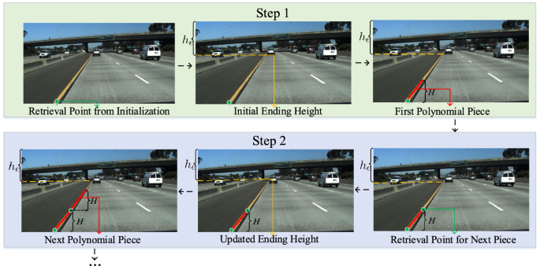 

## SONUÇLAR :
TuSimple ve CULane'deki veri kümeleri önce 256 × 512 sonra 256 × 768 olacak şekilde yeniden boyutlandırılır. Ayrıca çeşitli veri büyütme stratejilerine başvurulmuştur: ters döndürme, döndürme, parlaklık değişimi.
 
**TuSimple**

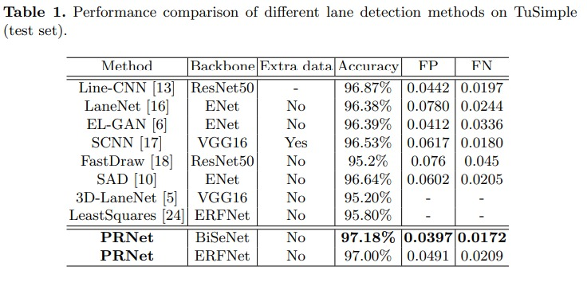
 
**CuLane**

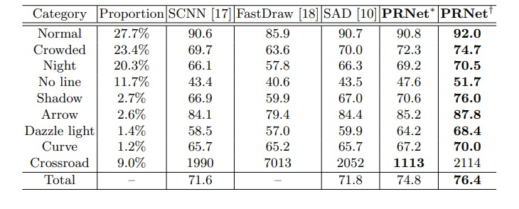 

**Segmentasyon Regresyon Karşılaştırılması** 
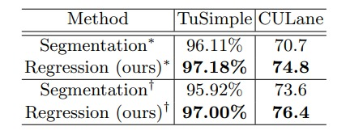 
 
**Polinom Derecesi ve Yükseklik**
 
Polinom derecesi ve polinom parçalarının yüksekliği şerit eğrilerini tanımlama yeteneğini ve karmaşıklığını temsil eden önemli parametrelerdir. Örneğin daha küçük bir polinom yüksekliği, daha kısa olduğundan daha düşük bir polinom derecesi gerektirir. Dolayısıyla şerit bölümlerinin eğrilerle yerleştirilmesi daha kolaydır.
Burada polinom derecesi ve H(yükseklik) degerlerinin farklı kombinasyonlarının etkilerini incelenmistir. 
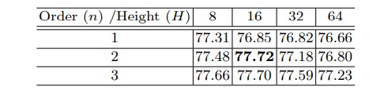 
 
**Farklı Yöntemlerin run-time Performansları** 

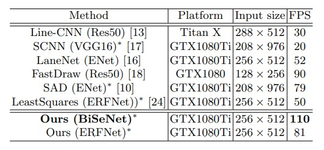 
 
**Başarısızlıkların İstatistikleri** 

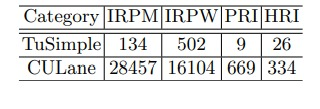 

* **(IRPM) tespit edilemeyen ilk erişim noktası** 
* **(IRPW) yanlış tespit edilen ilk erişim noktası** 
* **(PRI) yanlış polinom regresyon** 
* **(HRI) yanlış yükseklik regresyonu** 
 
Başarısızlıkların çoğunun ilk erişim noktalarıyla ilgili olduğu görülebilir.
Eksik tespitlerin karanlık ışık , araçlar ve şerit çizgilerinin olmadığı anlardan kaynaklandığı , yanlış tespitlerin çoğunun yanıltıcı(şerit benzeri çizgiler) ve karmaşık görüntülerde olduğu tespit edilmiştir. Yine de tablolardaki veriler değerlendirildiğinde PRNet in diğer yöntemlere göre daha iyi sonuçlar verdiği kanıtlanmıştır.

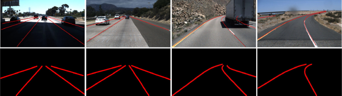 

1.satır ground truth 
2.satır PRNET  
Sırasıyla ilk erişim noktası hatası, eksik tespit, yanlış polynom regresyon, yanlış yükseklik regresyonu görselleştirilmiştir.

 
 
 

 

